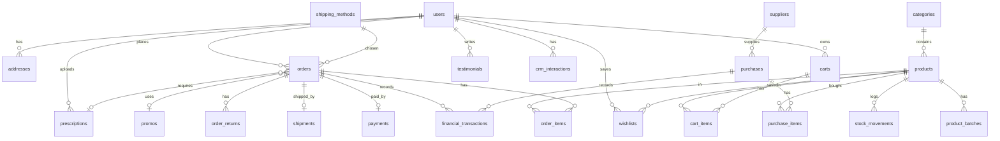

# 02 — Database (MySQL) — ERD & Skema

Konvensi: tabel plural snake_case, PK `id` bigint, timestamps, soft delete di `products`, `users`. Uang = `unsignedBigInteger` (rupiah).

## ERD (Mermaid)


## Tabel
**users**: id, name, email(unique), password, phone, role enum(`admin`,`pharmacist`,`customer`) default customer, avatar, google_id nullable, notify_email bool default true, notify_promo bool default true, last_login_at, email_verified_at, soft deletes.

**addresses**: id, user_id FK, label, recipient_name, phone, province, city, district, postal_code, address_line, is_default bool.

**categories**: id, name, slug(unique), description, image, is_active.

**products**: id, category_id FK, sku(unique), name, slug(unique), description, composition, dosage, manufacturer, drug_class enum(`bebas`,`bebas_terbatas`,`keras`,`herbal`,`suplemen`,`alkes`), requires_prescription bool, unit (strip/botol/box/pcs), price, cost_price, stock (unsigned int, CHECK >=0), min_stock default 10, weight_gram, image, is_active, is_featured, sold_count default 0, soft deletes. Index: category_id, is_active, name.

**product_batches**: id, product_id FK, batch_no, expiry_date, qty_in, qty_remaining, purchase_item_id nullable. Index expiry_date. (`products.stock` = jumlah qty_remaining semua batch yang belum kedaluwarsa + stok tanpa batch; sederhana: jaga `products.stock` sebagai sumber utama, batch untuk pelacakan expiry, pengurangan FEFO.)

**stock_movements**: id, product_id FK, batch_id nullable, type enum(`purchase`,`sale`,`return`,`adjustment`,`cancel_restore`,`expired_writeoff`), qty (signed int), stock_after, reference_type, reference_id, note, created_by nullable. Index (product_id, created_at).

**suppliers**: id, name, contact_person, phone, email, address, is_active.
**purchases**: id, purchase_number(unique), supplier_id FK, purchase_date, total, status enum(`draft`,`received`,`cancelled`), note, created_by.
**purchase_items**: id, purchase_id FK, product_id FK, qty, unit_cost, subtotal, batch_no, expiry_date.

**carts**: id, user_id FK(unique per user). **cart_items**: id, cart_id FK, product_id FK, qty. unique(cart_id, product_id).
**wishlists**: id, user_id FK, product_id FK; unique(user_id, product_id).

**shipping_methods**: id, name (mis. Kurir Apotek, JNE Reguler, Ambil di Toko), code, base_cost, cost_per_kg, est_days, is_cod_available bool, is_active.
**promos**: id, code(unique), name, description, type enum(`percent`,`fixed`), value, min_purchase, max_discount nullable, quota nullable, used_count, starts_at, ends_at, banner, is_active.
**prescriptions**: id, user_id FK, file_path, doctor_name nullable, status enum(`pending`,`approved`,`rejected`), reviewed_by nullable, reviewed_at, note.

**orders**: id, order_number(unique, format `APT-YYYYMMDD-XXXX`), user_id FK, status enum(`pending_payment`,`awaiting_prescription`,`paid`,`processing`,`shipped`,`delivered`,`completed`,`cancelled`,`expired`,`refunded`), payment_method enum(`midtrans`,`cod`), payment_status enum(`unpaid`,`paid`,`failed`,`refunded`), subtotal, discount_total, shipping_cost, grand_total, promo_id nullable, shipping_method_id FK, prescription_id nullable, recipient_name, recipient_phone, shipping_address (text snapshot), note, expires_at, paid_at, completed_at, cancelled_at. Index: user_id, status, created_at.
**order_items**: id, order_id FK, product_id FK, product_name (snapshot), sku, price (snapshot), cost_price (snapshot, untuk laba), qty, subtotal.

**payments**: id, order_id FK, provider(`midtrans`/`cod`/`manual`), midtrans_order_id(unique), snap_token, transaction_id, payment_type, bank/va_number nullable, gross_amount, transaction_status, fraud_status, status enum(`pending`,`paid`,`failed`,`expired`,`refunded`), raw_response json, paid_at. Index midtrans_order_id.
**shipments**: id, order_id FK, courier, service, tracking_number, cost, status enum(`pending`,`packed`,`shipped`,`delivered`,`returned`), shipped_at, delivered_at, note.
**order_returns**: id, order_id FK, order_item_id FK, user_id FK, type enum(`return`,`exchange`), qty, reason, evidence_image, status enum(`requested`,`approved`,`rejected`,`completed`), admin_note, resolved_at.

**financial_transactions**: id, type enum(`income`,`expense`), category enum(`sales`,`refund`,`purchase`,`operational`,`salary`,`other`), amount, transaction_date, description, reference_type, reference_id, created_by nullable. Index (type, transaction_date).
  - Pendapatan otomatis (`sales`) saat payment `paid` (Midtrans) atau COD `delivered`.
  - `purchase` otomatis saat pembelian `received`. `refund` saat retur selesai.

**crm_leads**: id, name, phone, email, source(`website`,`walk_in`,`referral`,`social`), status enum(`new`,`contacted`,`converted`,`lost`), note, user_id nullable (jika sudah jadi customer).
**crm_interactions**: id, user_id nullable, lead_id nullable, type enum(`call`,`whatsapp`,`email`,`visit`,`note`), summary, interacted_at, created_by.
**testimonials**: id, user_id nullable, name, rating(1-5), content, is_approved, photo.
**blog_posts**: id, title, slug, excerpt, content, cover_image, author_id, is_published, published_at.
**faqs**: id, question, answer, sort_order, is_active.
**contact_messages**: id, name, email, phone, subject, message, is_read.
**settings**: id, key(unique), value(text), group. Kunci: site_name, logo, favicon, phone, email, address, maps_embed_url, vision, mission, about, terms, privacy, free_shipping_min.
**page_visits**: id, path, ip_hash, user_agent, user_id nullable, visited_at. (Untuk laporan pengunjung; middleware sederhana, skip bot & route admin.)

## Constraint & Index Wajib
- `products.stock` CHECK (stock >= 0) — untuk MySQL 8.0.16+; SQLite ok via trigger/skip (aplikasi tetap validasi).
- FK `onDelete restrict` untuk order_items→products; `cascade` untuk cart_items.
- Index tanggal untuk laporan: `orders(created_at)`, `financial_transactions(transaction_date)`, `page_visits(visited_at)`.

## Query Laporan (referensi)
```sql
-- Penjualan harian
SELECT DATE(paid_at) tgl, COUNT(*) jml_order, SUM(grand_total) omzet
FROM orders WHERE payment_status='paid' AND paid_at BETWEEN ? AND ? GROUP BY DATE(paid_at);
-- Produk terlaris
SELECT product_id, product_name, SUM(qty) terjual, SUM(subtotal) omzet
FROM order_items oi JOIN orders o ON o.id=oi.order_id
WHERE o.payment_status='paid' GROUP BY product_id, product_name ORDER BY terjual DESC LIMIT 10;
-- Laba kotor
SELECT SUM(oi.subtotal - oi.cost_price*oi.qty) FROM order_items oi JOIN orders o ON o.id=oi.order_id WHERE o.payment_status='paid';
```
> Gunakan fungsi tanggal yang kompatibel (`DATE()`); untuk bulanan `DATE_FORMAT` (MySQL) — bungkus di Service agar bisa dialihkan ke SQLite (`strftime`).
